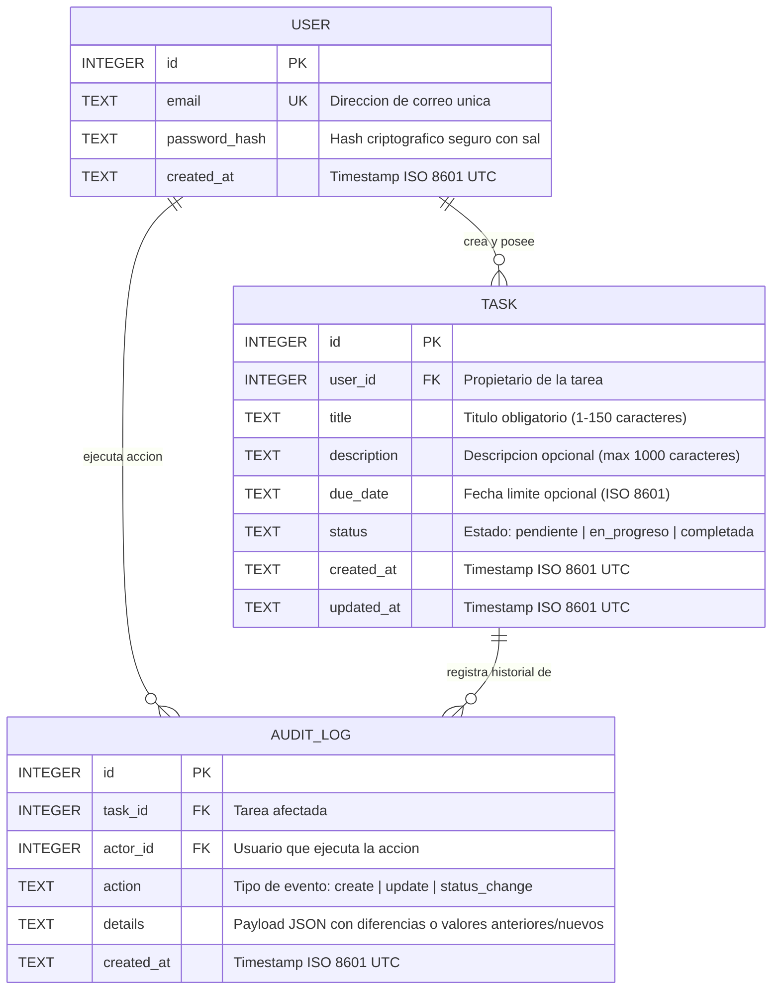
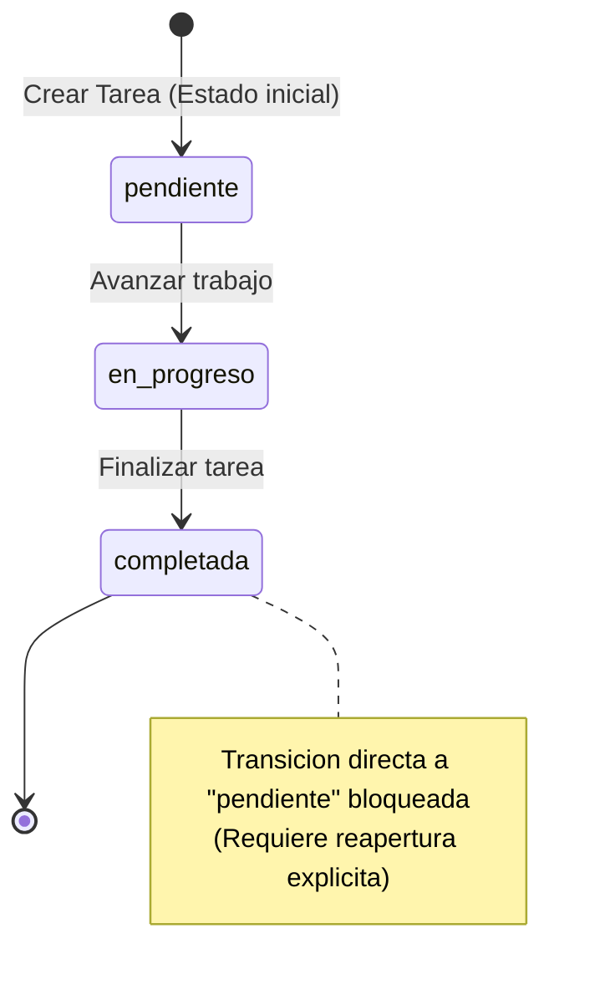

# Data Model Specification: Gestión Básica de Tareas y Autenticación

**Feature**: `001-auth-task-management`
**Date**: 2026-09-29
**Status**: Approved

## 1. Diagrama Entidad-Relación



---

## 2. Entidades y Reglas de Negocio

### 2.1 Entidad `User` (Usuario)

Representa a una persona registrada con acceso a la plataforma.

| Campo | Tipo | Nulable | Restricciones / Validación | Descripción |
|---|---|---|---|---|
| `id` | INTEGER | No | Clave primaria autonumérica | Identificador único del usuario |
| `email` | TEXT | No | Único, normalizado en minúsculas, formato email RFC 5322 | Correo electrónico de acceso |
| `password_hash` | TEXT | No | Hash scrypt / pbkdf2 generado desde texto plano >= 8 caracteres | Credencial encriptada |
| `created_at` | TEXT | No | Formato ISO 8601 UTC (ej. `2026-09-29T21:00:00Z`) | Fecha y hora de registro |

**Reglas de Validación**:
- El correo no puede estar vacío ni repetirse en el sistema (`FR-002`).
- La contraseña en texto plano debe contener al menos 8 caracteres al registrarse (`FR-001`).
- La contraseña nunca se persiste en texto plano (`FR-003`).

---

### 2.2 Entidad `Task` (Tarea)

Representa una unidad de trabajo asignada a un usuario.

| Campo | Tipo | Nulable | Restricciones / Validación | Descripción |
|---|---|---|---|---|
| `id` | INTEGER | No | Clave primaria autonumérica | Identificador único de la tarea |
| `user_id` | INTEGER | No | Clave foránea a `User.id` (ON DELETE CASCADE) | Propietario de la tarea |
| `title` | TEXT | No | Longitud de 1 a 150 caracteres tras eliminar espacios en blanco | Título descriptivo |
| `description` | TEXT | Sí | Longitud máxima de 1,000 caracteres | Notas o detalles adicionales |
| `due_date` | TEXT | Sí | Formato ISO 8601 (`YYYY-MM-DD` o `YYYY-MM-DDTHH:MM:SSZ`) | Fecha de vencimiento opcional |
| `status` | TEXT | No | Valores permitidos: `'pendiente'`, `'en_progreso'`, `'completada'`. Default: `'pendiente'` | Estado en el ciclo de vida |
| `created_at` | TEXT | No | Formato ISO 8601 UTC | Fecha y hora de creación |
| `updated_at` | TEXT | No | Formato ISO 8601 UTC | Fecha y hora de última modificación |

**Reglas de Validación**:
- `title` es obligatorio; cadenas de solo espacios en blanco se rechazan (`FR-007`).
- `status` inicial es siempre `'pendiente'` (`FR-008`).
- Orden de consulta por defecto: `created_at DESC` (`FR-009`).
- Toda tarea pertenece estrictamente a un usuario y ningún otro usuario puede leerla ni mutarla (`FR-009`, `SC-002`).

---

### 2.3 Entidad `AuditLog` (Registro de Auditoría)

Representa el historial inmutable de cambios sobre cada tarea.

| Campo | Tipo | Nulable | Restricciones / Validación | Descripción |
|---|---|---|---|---|
| `id` | INTEGER | No | Clave primaria autonumérica | Identificador único del evento |
| `task_id` | INTEGER | No | Clave foránea a `Task.id` (ON DELETE CASCADE) | Tarea vinculada |
| `actor_id` | INTEGER | No | Clave foránea a `User.id` | Usuario que ejecutó la acción |
| `action` | TEXT | No | Valores permitidos: `'create'`, `'update'`, `'status_change'` | Categoría de la acción |
| `details` | TEXT | No | Formato JSON válido serializado | Snapshot de campos alterados |
| `created_at` | TEXT | No | Formato ISO 8601 UTC | Fecha y hora exacta del suceso |

**Reglas de Validación**:
- Registro estrictamente inmutable (no admite sentencias `UPDATE` ni `DELETE` directas).
- Debe crearse un registro por cada evento de creación (`create`), modificación de datos (`update`) o transición de estado (`status_change`) (`FR-014`).

---

## 3. Máquina de Estados de la Tarea



### Transiciones Válidas e Inválidas

| Estado Actual | Nuevo Estado Solicitado | Permitido | Acción / Resultado |
|---|---|---|---|
| `pendiente` | `en_progreso` | **SÍ** | Estado actualizado a `en_progreso`; registro de auditoría generado (`status_change`). |
| `en_progreso` | `completada` | **SÍ** | Estado actualizado a `completada`; registro de auditoría generado (`status_change`). |
| `completada` | `pendiente` | **NO** | Error 400 Bad Request: "No se puede retroceder de completada a pendiente directamente". |
| `completada` | `en_progreso` | **NO** | Error 400 Bad Request: Transición no permitida. |
| `*` | *Estado Desconocido* | **NO** | Error 400 Bad Request: Estado no reconocido por la máquina de estados. |

---

## 4. Esquema DDL SQL (SQLite 3)

```sql
PRAGMA foreign_keys = ON;

-- Tabla de Usuarios
CREATE TABLE IF NOT EXISTS users (
    id INTEGER PRIMARY KEY AUTOINCREMENT,
    email TEXT NOT NULL UNIQUE COLLATE NOCASE,
    password_hash TEXT NOT NULL,
    created_at TEXT NOT NULL
);

CREATE INDEX IF NOT EXISTS idx_users_email ON users(email);

-- Tabla de Tareas
CREATE TABLE IF NOT EXISTS tasks (
    id INTEGER PRIMARY KEY AUTOINCREMENT,
    user_id INTEGER NOT NULL,
    title TEXT NOT NULL,
    description TEXT,
    due_date TEXT,
    status TEXT NOT NULL DEFAULT 'pendiente' CHECK (status IN ('pendiente', 'en_progreso', 'completada')),
    created_at TEXT NOT NULL,
    updated_at TEXT NOT NULL,
    FOREIGN KEY (user_id) REFERENCES users(id) ON DELETE CASCADE
);

CREATE INDEX IF NOT EXISTS idx_tasks_user_id ON tasks(user_id);
CREATE INDEX IF NOT EXISTS idx_tasks_user_status ON tasks(user_id, status);
CREATE INDEX IF NOT EXISTS idx_tasks_user_created ON tasks(user_id, created_at DESC);

-- Tabla de Logs de Auditoria
CREATE TABLE IF NOT EXISTS audit_logs (
    id INTEGER PRIMARY KEY AUTOINCREMENT,
    task_id INTEGER NOT NULL,
    actor_id INTEGER NOT NULL,
    action TEXT NOT NULL CHECK (action IN ('create', 'update', 'status_change')),
    details TEXT NOT NULL,
    created_at TEXT NOT NULL,
    FOREIGN KEY (task_id) REFERENCES tasks(id) ON DELETE CASCADE,
    FOREIGN KEY (actor_id) REFERENCES users(id)
);

CREATE INDEX IF NOT EXISTS idx_audit_logs_task ON audit_logs(task_id);
CREATE INDEX IF NOT EXISTS idx_audit_logs_actor ON audit_logs(actor_id);
```
