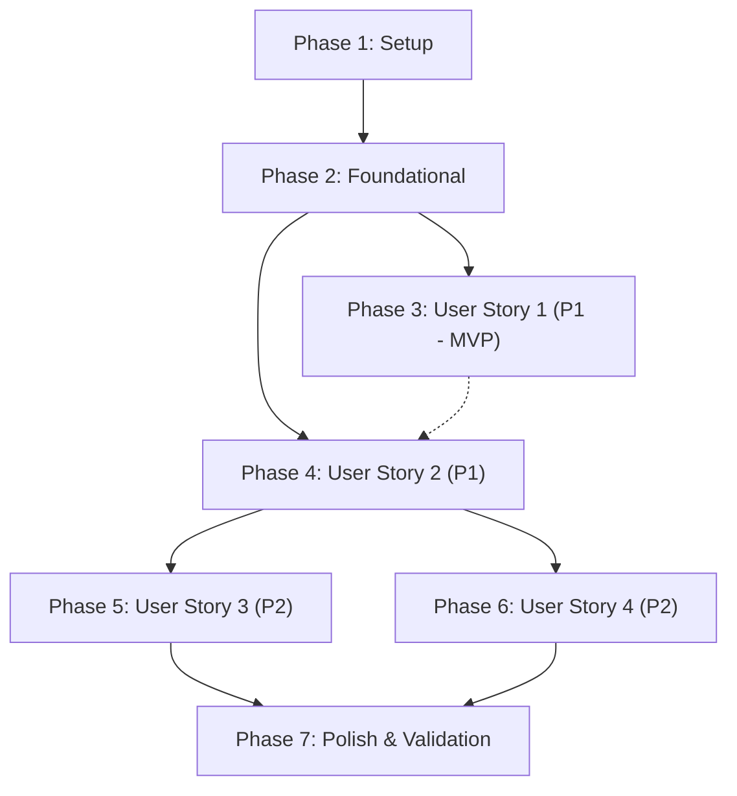

# Tasks: Gestión Básica de Tareas y Autenticación

**Feature**: `001-auth-task-management`
**Date**: 2026-09-29
**Status**: Ready for Implementation
**Spec**: [spec.md](spec.md) | **Plan**: [plan.md](plan.md) | **Data Model**: [data-model.md](data-model.md)

---

## Phase 1: Setup (Shared Infrastructure)

**Purpose**: Inicialización del proyecto, dependencias y estructura de directorios.

- [X] T001 Create modular monolith project structure (`src/domain`, `src/infrastructure`, `src/web/templates/auth`, `src/web/templates/tasks`, `src/web/static/css`, `src/web/static/js`, `tests/unit`, `tests/integration`) per implementation plan
- [X] T002 Initialize Python dependencies file in `requirements.txt` with `flask>=3.0`, `pytest>=8.0`, `pytest-cov>=4.0`
- [X] T003 [P] Configure pytest fixtures, Flask test client factory, and in-memory SQLite database setup in `tests/conftest.py`

---

## Phase 2: Foundational (Blocking Prerequisites)

**Purpose**: Infraestructura central de base de datos, excepciones, seguridad y servidor web.

> **CRITICAL**: No se puede iniciar la implementación de ninguna historia de usuario hasta completar esta fase.

- [X] T004 Implement SQLite connection manager with `PRAGMA foreign_keys = ON;` and table creation DDL (`users`, `tasks`, `audit_logs`) in `src/infrastructure/database.py`
- [X] T005 [P] Implement domain exceptions hierarchy (`DomainError`, `ValidationError`, `UnauthorizedError`, `NotFoundError`, `ConflictError`, `InvalidStateTransitionError`) in `src/domain/exceptions.py`
- [X] T006 [P] Implement password hashing utilities using Werkzeug (`scrypt`/`pbkdf2:sha256` with salt) in `src/infrastructure/security.py`
- [X] T007 Implement Flask application factory (`create_app`) with secret key configuration and session cookie parameters (`HttpOnly=True`, `SameSite='Lax'`, 24-hour inactivity timeout) in `src/web/app.py`
- [X] T008 [P] Create master Jinja2 template layout with responsive navbar, flash notifications banner, and session state container in `src/web/templates/base.html`
- [X] T009 [P] Create global responsive stylesheet in `src/web/static/css/style.css`

**Checkpoint**: Base fundacional completa. La implementación de historias de usuario puede comenzar.

---

## Phase 3: User Story 1 - Registro y Acceso Seguro de Usuarios (Priority: P1) 🎯 MVP

**Goal**: Permitir a nuevos usuarios registrarse con correo electrónico único y contraseña con longitud mínima de 8 caracteres, iniciar sesión de forma segura estableciendo cookie de sesión HttpOnly y cerrar sesión.

**Independent Test**: Registrar un usuario con credenciales válidas, validar el rechazo de contraseñas de menos de 8 caracteres y correos duplicados, verificar inicio de sesión con cookie de 24h y posterior cierre de sesión.

### Tests for User Story 1 (Test-First)

> **NOTE**: Escribir estas pruebas primero y verificar que fallen en rojo antes de implementar.

- [X] T010 [P] [US1] Write unit tests for user registration, password length validation ("mínimo 8 caracteres"), and email uniqueness in `tests/unit/test_user_service.py`
- [X] T011 [P] [US1] Write integration tests for `/register`, `/login`, and `/logout` routes, session cookie verification (`HttpOnly`), and 401 unauthorized handling in `tests/integration/test_auth_routes.py`

### Implementation for User Story 1

- [X] T012 [P] [US1] Implement `User` domain entity dataclass (`id: int`, `email: str` unique lowercase RFC 5322, `password_hash: str`, `created_at: str` ISO 8601 UTC) in `src/domain/models.py`
- [X] T013 [US1] Implement `UserRepository` SQLite database queries (`create_user`, `get_user_by_id`, `get_user_by_email`) in `src/infrastructure/repositories.py`
- [X] T014 [US1] Implement `UserService` in `src/domain/services.py` with registration business rules (password >= 8 chars, email format check, hashing with salt) and authentication verification
- [X] T015 [US1] Implement authentication blueprint routes (`GET /register`, `POST /register`, `GET /login`, `POST /login`, `POST /logout`) and `@login_required` session decorator in `src/web/auth_routes.py`
- [X] T016 [P] [US1] Create registration HTML form template with 8-character password helper in `src/web/templates/auth/register.html`
- [X] T017 [P] [US1] Create login HTML form template with credential error messages in `src/web/templates/auth/login.html`

**Checkpoint**: User Story 1 (MVP) completada e independientemente verificable.

---

## Phase 4: User Story 2 - Creación y Visualización de Tareas (Priority: P1)

**Goal**: Permitir a los usuarios autenticados crear tareas asignando título obligatorio (1 a 150 caracteres), descripción opcional (hasta 1,000 caracteres) y fecha límite opcional, visualizarlas en orden cronológico descendente (`created_at DESC`), filtrar por estado ("pendiente", "en_progreso", "completada") y desplegar un estado vacío asistido si no hay tareas.

**Independent Test**: Iniciar sesión, crear varias tareas con distintas combinaciones de campos, verificar orden descendente por fecha de creación, comprobar que la vista vacía muestra mensaje de bienvenida con botón de acción, verificar filtros y comprobar aislamiento estricto (ningún usuario ve tareas de otro).

### Tests for User Story 2 (Test-First)

- [X] T018 [P] [US2] Write unit tests for task creation validation (title "1 a 150 caracteres tras eliminar espacios", description "máximo 1,000 caracteres", status inicial obligatorio "'pendiente'") and reverse chronological sorting in `tests/unit/test_task_service.py`
- [X] T019 [P] [US2] Write integration tests for task creation (`POST /tasks`), task list view (`GET /tasks`), status filtering (`?status=...`), empty state rendering, and multi-user data isolation in `tests/integration/test_task_routes.py`

### Implementation for User Story 2

- [X] T020 [P] [US2] Implement `Task` domain entity dataclass (`id: int`, `user_id: int`, `title: str` 1-150 chars, `description: str | None` max 1000 chars, `due_date: str | None`, `status: str` default 'pendiente', `created_at: str`, `updated_at: str`) in `src/domain/models.py`
- [X] T021 [P] [US2] Implement `AuditLog` domain entity dataclass (`id: int`, `task_id: int`, `actor_id: int`, `action: str` in 'create'/'update'/'status_change', `details: str` JSON, `created_at: str` ISO 8601 UTC) in `src/domain/models.py`
- [X] T022 [US2] Implement `TaskRepository` and `AuditLogRepository` SQLite queries (`create_task`, `get_task_by_id`, `list_tasks_by_user` with `ORDER BY created_at DESC` and status filtering, `create_audit_log`) in `src/infrastructure/repositories.py`
- [X] T023 [US2] Implement task creation and listing logic with automatic `AuditLog` entry creation (`action='create'`) in `src/domain/services.py`
- [X] T024 [US2] Implement task web routes (`GET /tasks`, `GET /tasks/create`, `POST /tasks`, `GET /api/tasks`) in `src/web/task_routes.py`
- [X] T025 [P] [US2] Create task list HTML template with status filter tabs, task items, and illustrated empty state container with "Crear mi primera tarea" button in `src/web/templates/tasks/list.html`
- [X] T026 [P] [US2] Create task creation HTML form template with character counter in `src/web/templates/tasks/create.html`

**Checkpoint**: User Stories 1 y 2 plenamente funcionales e integradas.

---

## Phase 5: User Story 3 - Transición y Control de Avance de Tareas (Priority: P2)

**Goal**: Permitir la actualización de estados de tareas siguiendo la máquina de estados finita (`pendiente` → `en_progreso` → `completada`), registrar de forma inmutable cada cambio en el log de auditoría con actor y timestamp, bloquear transiciones no autorizadas (como `completada` → `pendiente` sin reapertura) y soportar transiciones asíncronas con reversión visual (rollback) en el cliente JavaScript ante fallos.

**Independent Test**: Actualizar progresivamente el estado de una tarea de pendiente a en_progreso y completada, verificar que intentar retroceder a pendiente retorna error 400, verificar que se generó el registro en `audit_logs` con `action='status_change'`, y verificar que la interfaz revierte el cambio visual si la API retorna error.

### Tests for User Story 3 (Test-First)

- [X] T027 [P] [US3] Write unit tests for state machine transitions (valid transitions `pendiente` -> `en_progreso` -> `completada`, and illegal transitions rejection) in `tests/unit/test_state_machine.py`
- [X] T028 [P] [US3] Write integration tests for `PATCH /api/tasks/{id}/status`, transition rejection error responses, and audit log generation in `tests/integration/test_task_routes.py`

### Implementation for User Story 3

- [X] T029 [US3] Implement `TaskStateMachine` enforcing transitions (`pendiente` -> `en_progreso`, `en_progreso` -> `completada`) and throwing `InvalidStateTransitionError` for illegal transitions in `src/domain/state_machine.py`
- [X] T030 [US3] Implement `update_task_status` in `src/domain/services.py` ensuring state validation, task owner authorization, and atomic `AuditLog` persistence
- [X] T031 [US3] Implement `PATCH /api/tasks/{id}/status` endpoint adhering to `contracts/tasks-api.json` in `src/web/task_routes.py`
- [X] T032 [P] [US3] Implement client-side fetch API utility with JSON payload contracts and error rollback handling in `src/web/static/js/api.js`
- [X] T033 [P] [US3] Implement inline status advancement interaction with optimistic DOM update and rollback on failure in `src/web/static/js/tasks.js`

**Checkpoint**: User Stories 1, 2 y 3 completadas con máquina de estados y trazabilidad.

---

## Phase 6: User Story 4 - Modificación y Corrección de Tareas (Priority: P2)

**Goal**: Permitir editar el título (1 a 150 caracteres), descripción (hasta 1,000 caracteres) y fecha límite de una tarea existente del usuario, aplicando validación estricta y registrando el evento de modificación en el log de auditoría.

**Independent Test**: Modificar los datos de una tarea existente con valores válidos, comprobar que se actualiza en el listado y que se crea un registro en `audit_logs` con `action='update'`, y comprobar que enviar un título vacío o mayor a 150 caracteres es rechazado manteniendo los valores previos intactos.

### Tests for User Story 4 (Test-First)

- [X] T034 [P] [US4] Write unit tests for task update validation and audit diff recording in `tests/unit/test_task_service.py`
- [X] T035 [P] [US4] Write integration tests for task edit view (`GET /tasks/{id}/edit`) and update endpoint (`POST /tasks/{id}/edit`, `PUT /api/tasks/{id}`) in `tests/integration/test_task_routes.py`

### Implementation for User Story 4

- [X] T036 [US4] Implement `update_task` method in `src/domain/services.py` with ownership check, input validation (title 1-150 chars, description <=1000 chars), and `AuditLog` creation (`action='update'`)
- [X] T037 [US4] Implement task edit routes (`GET /tasks/{id}/edit`, `POST /tasks/{id}/edit`, `PUT /api/tasks/{id}`) in `src/web/task_routes.py`
- [X] T038 [P] [US4] Create task edit HTML form template with current value pre-population in `src/web/templates/tasks/edit.html`

**Checkpoint**: Todas las historias del primer incremento (HU-01 a HU-04 y HU-12, HU-13) implementadas.

---

## Phase 7: Polish & Cross-Cutting Concerns

**Purpose**: Verificación final, pruebas integrales y robustecimiento.

- [X] T039 [P] Implement database seeding script for quick local development testing in `src/infrastructure/seed.py`
- [X] T040 [P] Implement security verification ensuring proper escaping, CSRF protection, and HttpOnly cookies across `src/web/app.py`
- [X] T041 Run automated test suite with coverage report (`pytest --cov=src -v`) ensuring 100% test pass rate
- [X] T042 Execute manual end-to-end validation scenarios following `specs/001-auth-task-management/quickstart.md`

---

## Dependencies & Execution Order

### Phase Dependencies



- **Setup (Phase 1)**: Sin dependencias, inicia inmediatamente.
- **Foundational (Phase 2)**: Depende de Setup; bloquea la implementación de historias de usuario.
- **User Story 1 (Phase 3 - MVP)**: Depende de Foundational; provee autenticación de usuarios.
- **User Story 2 (Phase 4)**: Depende de Foundational; se integra con US1 para asociar tareas a usuarios autenticados.
- **User Story 3 (Phase 5)**: Depende de US2 (requiere entidad Task existente para avanzar estados).
- **User Story 4 (Phase 6)**: Depende de US2 (requiere entidad Task existente para editar).
- **Polish (Phase 7)**: Depende de la finalización de todas las historias de usuario.

### Parallel Opportunities

- **Fase 1**: `T003` puede ejecutarse en paralelo con `T002`.
- **Fase 2**: `T005`, `T006`, `T008` y `T009` pueden implementarse en paralelo una vez iniciado `T004`.
- **Fase 3 (US1)**: Pruebas `T010` y `T011` pueden escribirse en paralelo. Vistas HTML `T016` y `T017` pueden diseñarse en paralelo con el servicio `T014`.
- **Fase 4 (US2)**: Pruebas `T018` y `T019` pueden escribirse en paralelo. Entidades `T020` y `T021` pueden definirse en paralelo. Plantillas `T025` y `T026` pueden desarrollarse en paralelo con las rutas `T024`.
- **Fase 5 (US3)**: Pruebas `T027` y `T028` en paralelo. Scripts JS `T032` y `T033` en paralelo con la máquina de estados de backend `T029`.
- **Fase 6 (US4)**: Pruebas `T034` y `T035` en paralelo. Plantilla `T038` en paralelo con `T036`.
- **Fase 7**: Scripts `T039` y `T040` en paralelo.

---

## Parallel Example: User Story 1

```bash
# Escribir pruebas unitarias e integración en paralelo:
Task: "T010 [P] [US1] Write unit tests for user registration in tests/unit/test_user_service.py"
Task: "T011 [P] [US1] Write integration tests for auth routes in tests/integration/test_auth_routes.py"

# Desarrollar plantillas HTML en paralelo:
Task: "T016 [P] [US1] Create registration HTML form in src/web/templates/auth/register.html"
Task: "T017 [P] [US1] Create login HTML form in src/web/templates/auth/login.html"
```

---

## Implementation Strategy

### MVP First (User Story 1 Only)

1. Completar Fase 1 (Setup) y Fase 2 (Foundational).
2. Completar Fase 3 (User Story 1 - Autenticación).
3. **Pausar y Validar**: Ejecutar `pytest tests/unit/test_user_service.py tests/integration/test_auth_routes.py`.
4. El sistema cuenta con cuentas seguras y control de acceso funcional (MVP inicial).

### Incremental Delivery

1. **Incremento 1 (Base)**: Setup + Foundational + User Story 1 (Cuentas y Login).
2. **Incremento 2 (Núcleo de Tareas)**: User Story 2 (Crear y Listar tareas con orden cronológico y aislamiento).
3. **Incremento 3 (Ciclo de Vida)**: User Story 3 (Transiciones de estado deterministas, auditoría y rollback en JS).
4. **Incremento 4 (Mantenimiento)**: User Story 4 (Edición de tareas con auditoría).
5. **Incremento 5 (Calidad)**: Polish, cobertura total de pruebas y validación Quickstart E2E.
