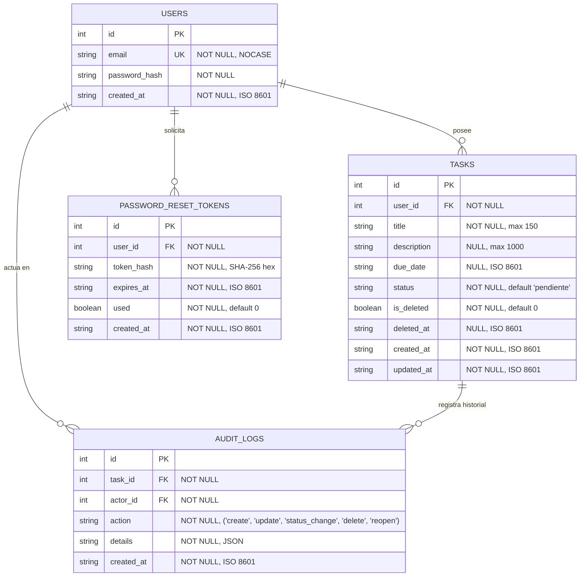
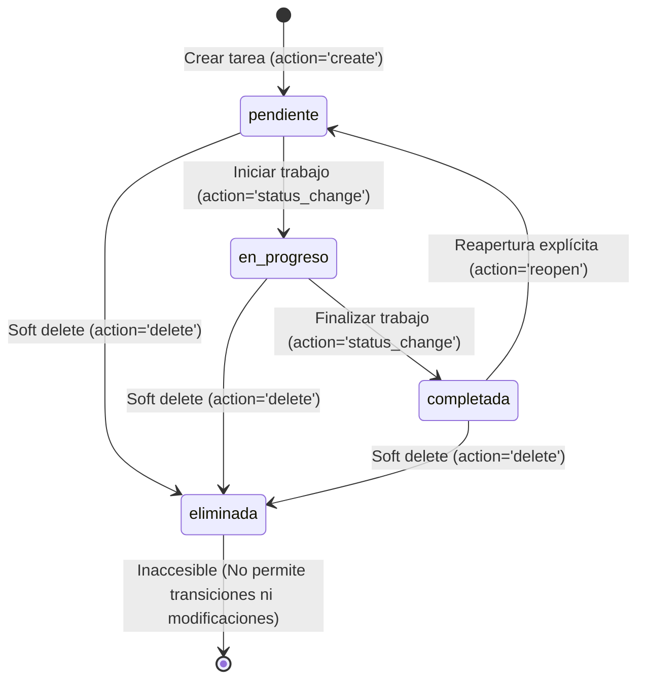

# Data Model: Cierre de Gestión de Tareas y Recuperación de Acceso

**Feature**: `002-task-lifecycle-access-recovery`  
**Date**: 2026-10-04  
**Status**: Completed  

---

## 1. Diagrama Entidad-Relación



---

## 2. Máquina de Estados del Ciclo de Vida de Tareas



### Reglas de Transición
1. **Transiciones Ordinarias de Avance**:
   - `pendiente` → `en_progreso` (válida).
   - `en_progreso` → `completada` (válida).
2. **Reapertura de Tarea**:
   - `completada` → `pendiente` (válida **únicamente** a través del método explícito `reopen_task`).
   - Se prohíbe invocar reapertura sobre tareas que se encuentren en `pendiente` o `en_progreso`.
3. **Eliminación Lógica**:
   - Cualquier estado activo (`pendiente`, `en_progreso`, `completada`) puede pasar a estado de eliminación lógica (`is_deleted=1`).
   - Una tarea eliminada lógicamente no admite ninguna transición posterior ni puede ser eliminada por segunda vez.

---

## 3. Especificación de Entidades de Datos

### A. Entidad `Task` (Extendida)

| Campo | Tipo | Nulo | Por Defecto | Descripción / Reglas |
|---|---|---|---|---|
| `id` | `INTEGER` | No | Auto | Identificador primario de la tarea. |
| `user_id` | `INTEGER` | No | - | Clave foránea referenciando `users(id)`. ON DELETE CASCADE. |
| `title` | `VARCHAR(150)` | No | - | Título obligatorio, de 1 a 150 caracteres. No solo espacios. |
| `description` | `VARCHAR(1000)`| Sí | `NULL` | Descripción opcional, hasta 1,000 caracteres. |
| `due_date` | `VARCHAR(30)` | Sí | `NULL` | Fecha límite opcional en formato ISO 8601 (`YYYY-MM-DD`). |
| `status` | `VARCHAR(20)` | No | `'pendiente'` | Restringido a `('pendiente', 'en_progreso', 'completada')`. |
| `is_deleted` | `BOOLEAN` | No | `0` (`False`)| **Nuevo en Inc 2**: `1` si fue eliminada lógicamente; `0` si está activa. |
| `deleted_at` | `VARCHAR(35)` | Sí | `NULL` | **Nuevo en Inc 2**: Timestamp ISO 8601 del momento de la eliminación. |
| `created_at` | `VARCHAR(35)` | No | - | Timestamp ISO 8601 de creación. |
| `updated_at` | `VARCHAR(35)` | No | - | Timestamp ISO 8601 de última modificación o transición. |

**Índices recomendados**:
- `idx_tasks_user_active`: `(user_id, is_deleted, created_at DESC)` (optimiza la consulta predeterminada del listado).

---

### B. Entidad `PasswordResetToken` (Nueva)

| Campo | Tipo | Nulo | Por Defecto | Descripción / Reglas |
|---|---|---|---|---|
| `id` | `INTEGER` | No | Auto | Clave primaria del token. |
| `user_id` | `INTEGER` | No | - | Clave foránea referenciando `users(id)`. ON DELETE CASCADE. |
| `token_hash` | `VARCHAR(64)` | No | - | Hash SHA-256 en hexadecimal del token de 32 bytes emitido al usuario. |
| `expires_at` | `VARCHAR(35)` | No | - | Timestamp ISO 8601. Establecido exactamente a `created_at + 30 minutos`. |
| `used` | `BOOLEAN` | No | `0` (`False`)| `1` cuando el token ya fue consumido exitosamente; `0` si está pendiente. |
| `created_at` | `VARCHAR(35)` | No | - | Timestamp ISO 8601 de generación. |

**Índices recomendados**:
- `idx_reset_token_hash`: `(token_hash)` (búsqueda rápida al verificar el enlace).
- `idx_reset_token_user_pending`: `(user_id, used)` (permite revocar tokens anteriores del mismo usuario).

---

### C. Entidad `AuditLog` (Extendida en Acciones)

| Campo | Tipo | Nulo | Por Defecto | Descripción / Reglas |
|---|---|---|---|---|
| `id` | `INTEGER` | No | Auto | Clave primaria del evento. |
| `task_id` | `INTEGER` | No | - | Clave foránea referenciando `tasks(id)`. |
| `actor_id` | `INTEGER` | No | - | Clave foránea referenciando `users(id)`. |
| `action` | `VARCHAR(20)` | No | - | Tipos permitidos: `('create', 'update', 'status_change', 'delete', 'reopen')`. |
| `details` | `TEXT` | No | - | Carga JSON inmutable describiendo los campos modificados o estados anterior/nuevo. |
| `created_at` | `VARCHAR(35)` | No | - | Timestamp ISO 8601 inmutable del momento del evento. |

---

## 4. Definición de Modelos ORM (SQLAlchemy)

```python
# src/infrastructure/models.py
from datetime import datetime, timezone
from src.infrastructure.database import db

class UserORM(db.Model):
    __tablename__ = "users"
    id = db.Column(db.Integer, primary_key=True, autoincrement=True)
    email = db.Column(db.String(255), unique=True, nullable=False, index=True)
    password_hash = db.Column(db.String(255), nullable=False)
    created_at = db.Column(db.String(35), nullable=False)
    
    tasks = db.relationship("TaskORM", backref="user", cascade="all, delete-orphan", lazy="dynamic")
    reset_tokens = db.relationship("PasswordResetTokenORM", backref="user", cascade="all, delete-orphan", lazy="dynamic")

class TaskORM(db.Model):
    __tablename__ = "tasks"
    id = db.Column(db.Integer, primary_key=True, autoincrement=True)
    user_id = db.Column(db.Integer, db.ForeignKey("users.id", ondelete="CASCADE"), nullable=False, index=True)
    title = db.Column(db.String(150), nullable=False)
    description = db.Column(db.String(1000), nullable=True)
    due_date = db.Column(db.String(30), nullable=True)
    status = db.Column(db.String(20), nullable=False, default="pendiente")
    is_deleted = db.Column(db.Boolean, nullable=False, default=False)
    deleted_at = db.Column(db.String(35), nullable=True)
    created_at = db.Column(db.String(35), nullable=False)
    updated_at = db.Column(db.String(35), nullable=False)

    __table_args__ = (
        db.Index("idx_tasks_user_active", "user_id", "is_deleted", "created_at"),
    )

class PasswordResetTokenORM(db.Model):
    __tablename__ = "password_reset_tokens"
    id = db.Column(db.Integer, primary_key=True, autoincrement=True)
    user_id = db.Column(db.Integer, db.ForeignKey("users.id", ondelete="CASCADE"), nullable=False, index=True)
    token_hash = db.Column(db.String(64), nullable=False, index=True)
    expires_at = db.Column(db.String(35), nullable=False)
    used = db.Column(db.Boolean, nullable=False, default=False)
    created_at = db.Column(db.String(35), nullable=False)

class AuditLogORM(db.Model):
    __tablename__ = "audit_logs"
    id = db.Column(db.Integer, primary_key=True, autoincrement=True)
    task_id = db.Column(db.Integer, db.ForeignKey("tasks.id", ondelete="CASCADE"), nullable=False, index=True)
    actor_id = db.Column(db.Integer, db.ForeignKey("users.id"), nullable=False, index=True)
    action = db.Column(db.String(20), nullable=False)
    details = db.Column(db.Text, nullable=False)
    created_at = db.Column(db.String(35), nullable=False)

    __table_args__ = (
        db.CheckConstraint(
            "action IN ('create', 'update', 'status_change', 'delete', 'reopen')",
            name="chk_audit_logs_action"
        ),
        db.Index("idx_audit_logs_task", "task_id"),
        db.Index("idx_audit_logs_actor", "actor_id"),
    )
```

---

## 5. Script de Migración Alembic (Evolución de Esquema 002)

```python
# Operaciones en migrations/versions/yyyy_002_task_lifecycle_recovery.py
def upgrade():
    # 1. Modificación de tasks (añadir columnas de soft delete)
    with op.batch_alter_table("tasks", schema=None) as batch_op:
        batch_op.add_column(sa.Column("is_deleted", sa.Boolean(), nullable=False, server_default=sa.text("0")))
        batch_op.add_column(sa.Column("deleted_at", sa.String(length=35), nullable=True))
        batch_op.create_index("idx_tasks_user_active", ["user_id", "is_deleted", "created_at"], unique=False)

    # 2. Modificación de audit_logs en SQLite (ampliación de restricción CHECK)
    # En SQLite las restricciones no se modifican directamente; se usa batch mode con recreate="always"
    # para copiar filas preexistentes, reconstruir claves foráneas e índices.
    with op.batch_alter_table("audit_logs", recreate="always", schema=None) as batch_op:
        batch_op.create_check_constraint(
            "chk_audit_logs_action",
            "action IN ('create', 'update', 'status_change', 'delete', 'reopen')"
        )

    # 3. Creación de tabla password_reset_tokens
    op.create_table(
        "password_reset_tokens",
        sa.Column("id", sa.Integer(), autoincrement=True, nullable=False),
        sa.Column("user_id", sa.Integer(), nullable=False),
        sa.Column("token_hash", sa.String(length=64), nullable=False),
        sa.Column("expires_at", sa.String(length=35), nullable=False),
        sa.Column("used", sa.Boolean(), nullable=False, server_default=sa.text("0")),
        sa.Column("created_at", sa.String(length=35), nullable=False),
        sa.ForeignKeyConstraint(["user_id"], ["users.id"], ondelete="CASCADE"),
        sa.PrimaryKeyConstraint("id")
    )
    op.create_index("idx_reset_token_hash", "password_reset_tokens", ["token_hash"], unique=False)
```
