# Technical Research: Cierre de Gestión de Tareas y Recuperación de Acceso

**Feature**: `002-task-lifecycle-access-recovery`  
**Date**: 2026-10-04 (Actualizado)  
**Status**: Completed  

---

## 1. Estrategia de Soft Delete en el Modelo de Tareas (HU-05)

### Decisión
Extender el modelo `Task` en la capa de datos incorporando dos campos específicos:
- `is_deleted`: Booleano (`BOOLEAN NOT NULL DEFAULT 0` / `False`).
- `deleted_at`: Marca temporal opcional (`TEXT NULL` / `Optional[str]`), en formato ISO 8601 UTC.

En el modelo de dominio (`src/domain/models.py`), ambos campos tendrán valores por defecto (`is_deleted: bool = False`, `deleted_at: Optional[str] = None`) para no romper la instanciación de objetos en el código del Incremento 1.

En `TaskRepository` (`src/infrastructure/repositories.py`), se actualiza la cláusula `WHERE` del método `list_by_user` para forzar `AND is_deleted = 0` (o `deleted_at IS NULL`), garantizando que la consulta predeterminada del listado excluya siempre las tareas eliminadas sin alterar las firmas existentes.

### Razón
1. **Preservación de Trazabilidad e Integridad Relacional (Principio IV)**: La eliminación física (`DELETE FROM tasks WHERE id = ?`) destruiría las claves foráneas o borraría en cascada los registros de auditoría (`audit_logs`), perdiendo la trazabilidad. Con `is_deleted = 1` y `deleted_at`, la fila se mantiene intacta pero inaccesible para la operativa ordinaria.
2. **Compatibilidad hacia atrás**: Proporcionar valores por defecto en el constructor de `Task` asegura que el código existente de creación, actualización y filtrado siga funcionando sin excepciones de argumentos requeridos.

### Alternativas Consideradas
- *Solo bandera booleana (`is_deleted`)*: Descartada como insuficiente porque no informa de inmediato en la propia entidad cuándo se descartó la tarea sin obligar a un `JOIN` con `audit_logs`.
- *Tabla separada de tareas archivadas (`archived_tasks`)*: Descartada por violar el Principio V (YAGNI / sobreingeniería innecesaria en este incremento).

---

## 2. Tipificación de Reapertura y Evolución de la Restricción CHECK en SQLite (HU-06)

### Decisión
1. **Máquina de Estados (`TaskStateMachine` en `src/domain/state_machine.py`)**:
   - Se mantiene la restricción estricta del Incremento 1: una tarea `completada` **no puede transicionar por vía ordinaria**.
   - Se añade un método de dominio explícito: `validate_reopen(current_status: str) -> str`.
   - Si `current_status != "completada"`, se eleva `InvalidStateTransitionError("Solo las tareas completadas pueden ser reabiertas.")`.
   - Si `current_status == "completada"`, retorna determinísticamente `"pendiente"` (acordado en Clarification Q3).
2. **Ampliación de Restricción CHECK en SQLite (`audit_logs.action`)**:
   - En el Incremento 1, la tabla `audit_logs` posee la restricción DDL:
     `CHECK (action IN ('create', 'update', 'status_change'))`.
   - Debido a que SQLite no admite sentencias `ALTER TABLE ... DROP CONSTRAINT / ADD CONSTRAINT`, la revisión 002 de Alembic debe ejecutarse en **modo batch** (`op.batch_alter_table("audit_logs", recreate="always")`).
   - Alembic reconstruye la tabla bajo el capó:
     1. Crea una tabla temporal `_alembic_tmp_audit_logs` con la nueva restricción `CHECK (action IN ('create', 'update', 'status_change', 'delete', 'reopen'))`.
     2. Copia todas las filas históricas sin alterar valores.
     3. Elimina la tabla anterior y renombra la temporal.
     4. Reconstruye las claves foráneas e índices (`idx_audit_logs_task`, `idx_audit_logs_actor`).
   - Se diseñan pruebas automatizadas específicas que inserten registros con `action='delete'` y `action='reopen'` para comprobar que la restricción ampliada los admite y que sigue rechazando valores arbitrarios.

### Razón
El Principio IV y el criterio de aceptación de HU-06 exigen que la reapertura sea un evento **distinguible en el historial**, no confundible con la creación original ni con un cambio de avance ordinario (`status_change`). La migración en modo batch de SQLite es la única forma robusta de actualizar restricciones `CHECK` en este motor sin pérdida de datos ni corrupción de claves foráneas.

---

## 3. Tokens de Restablecimiento de Contraseña y Prevención de Enumeración (HU-14)

### Decisión
1. **Entropía y Generación**:
   - Se utiliza el módulo estándar `secrets` de Python: `raw_token = secrets.token_urlsafe(32)` (256 bits de entropía).
2. **Almacenamiento Seguro (Principio VII / Estándares de Seguridad)**:
   - Para no almacenar el token en texto plano en la base de datos (ante posibles volcados de BD o inspecciones no autorizadas), se almacena el hash criptográfico del token: `token_hash = hashlib.sha256(raw_token.encode()).hexdigest()`.
   - Al verificar, se toma el token enviado en la URL, se calcula su hash `sha256` y se busca en la base de datos.
3. **Ciclo de Vida y Expiración**:
   - Caducidad: 30 minutos desde su creación (`expires_at = now + timedelta(minutes=30)`).
   - Un solo uso: al restablecer la contraseña, se marca de forma atómica `used = 1` y `used_at = now`.
   - Revocación proactiva: Si el usuario solicita un nuevo enlace antes de que el anterior expire, cualquier token pendiente previo para ese usuario se marca como revocado/inválido (Clarification Q4).
4. **Mitigación de Enumeración de Usuarios y Alineación de Rutas**:
   - Las rutas se alinean con las existentes en `auth_bp` (sin prefijo `/auth`): `POST /forgot-password` y `POST /reset-password/<token>`.
   - El endpoint `POST /forgot-password` retorna exactamente la misma respuesta HTTP (`200 OK`) y el mismo mensaje neutral ("Si la dirección de correo electrónico está registrada en el sistema, se ha enviado un enlace para restablecer la contraseña") tanto si el usuario existe como si no existe.
   - Si el usuario no existe, se ejecuta una operación sintética equivalente (cálculo de hash) para nivelar el tiempo de procesamiento y reducir diferencias de respuesta observables, sin prometer garantías matemáticas absolutas contra ataques avanzados de canal lateral.

---

## 4. Mecanismo de Entrega de Enlace en Entorno de Desarrollo

### Decisión
Se implementa una interfaz de servicio de notificaciones con dos adaptadores:
- `NotificationService` (interfaz conceptual).
- `ConsoleNotificationService`: En el entorno de desarrollo y pruebas locales, imprime el enlace generado en `sys.stdout` / log de consola de Flask:
  `[DEV NOTIFICATION] Enlace de restablecimiento para {email}: http://localhost:5000/reset-password/{raw_token}`
- No se guarda el token en archivos de texto persistentes ni en base de datos en texto plano.

### Razón
1. **YAGNI y Alcance Académico (Principio V)**: En un entorno de laboratorio evaluado localmente, integrar servicios externos SMTP (SendGrid, Mailgun o cuentas personales con contraseñas de app) añade riesgos de credenciales expuestas en Git, fallas de conectividad externa y configuraciones complejas que escapan al objetivo formativo del incremento.
2. **Fidelidad y Seguridad**: Mantiene la respuesta web en el navegador 100% limpia y neutra, no equipara la impresión en terminal a un servicio de producción y exige que el usuario copie el enlace de la terminal para fines de prueba.

---

## 5. Estrategia de Migraciones Reproducible y Preservación Comprobada de Datos

### Problema Identificado
Ejecutar `flask db migrate` con `--autogenerate` contra `taskcontrol.db` ya poblada causaría que Alembic compare los modelos contra la base existente y detecte que las tablas ya existen, generando un archivo de migración inicial **vacío** (`def upgrade(): pass`). Esto impediría que una base de datos nueva o un entorno de CI/pruebas se inicialice desde cero.

### Procedimiento Técnico Reproducible

```mermaid
flowchart TD
    subgraph Generacion_Revision_001["1. Generación de Revisión Inicial 001"]
        A["Base de datos nueva/vacía (clean_init.db)"] --> B["flask --app src.web.app:create_app db init"]
        B --> C["flask --app src.web.app:create_app db migrate -m '001_initial_schema'"]
        C --> D["Revisión manual de 001: confirma create_table para users, tasks, audit_logs"]
    end

    subgraph Migracion_Base_Existente["2. Migración Segura de taskcontrol.db"]
        E["taskcontrol.db activa"] --> F["Respaldo obligatorio: taskcontrol_backup.db"]
        F --> G["Verificación previa: conteos (users=1, tasks=4, audit_logs=7) y PRAGMA"]
        G --> H["flask --app src.web.app:create_app db stamp <rev_001_id> (SÓLO 001)"]
        H --> I["flask --app src.web.app:create_app db migrate -m '002_task_lifecycle_recovery'"]
        I --> J["flask --app src.web.app:create_app db upgrade"]
        J --> K["Verificación posterior: recontar filas (1, 4, 7) y comprobar nuevas columnas"]
    end

    subgraph Pruebas_Automatizadas["3. Pruebas Automatizadas de Migración"]
        L["Prueba A: upgrade() completo de 001 y 002 desde base vacía"]
        M["Prueba B: estampación 001 + upgrade 002 sobre copia de BD real verificando conteos"]
    end
```



1. **Generación Limpia de la Revisión 001**:
   - Apuntar temporalmente la variable de entorno `DATABASE_PATH` a una base nueva vacía (`clean_init.db`).
   - Ejecutar:
     ```powershell
     $env:DATABASE_PATH = "clean_init.db"
     flask --app src.web.app:create_app db init
     flask --app src.web.app:create_app db migrate -m "001_initial_schema"
     Remove-Item env:DATABASE_PATH
     Remove-Item clean_init.db
     ```
   - Revisar que `migrations/versions/xxxx_001_initial_schema.py` contenga las sentencias DDL completas (`create_table` para `users`, `tasks`, `audit_logs`, con claves foráneas, restricciones e índices del Incremento 1).
2. **Procedimiento de Preservación sobre la Base Existente**:
   - **Respaldo previo obligatorio**: `Copy-Item taskcontrol.db taskcontrol_backup.db`.
   - **Registro de línea base**: Verificar y documentar conteos exactos antes de migrar (1 usuario, 4 tareas, 7 registros de auditoría).
   - **Estampado exclusivo**: Estampar **únicamente** la revisión 001 identificada por su ID (`flask --app src.web.app:create_app db stamp <revision_001_id>`), no `head`.
   - **Generación y aplicación de revisión 002**:
     ```powershell
     flask --app src.web.app:create_app db migrate -m "002_task_lifecycle_recovery"
     flask --app src.web.app:create_app db upgrade
     ```
   - **Verificación posterior obligatoria**: Comprobar que los conteos de filas se mantienen idénticos (1 usuario, 4 tareas, 7 logs), que `tasks` tiene `is_deleted=0` en los registros existentes y que la tabla `password_reset_tokens` fue creada.
3. **Pruebas Automatizadas de Migración**:
   - Se incorporan dos pruebas automatizadas en `tests/`:
     - *Test de migración limpia*: Aplica `upgrade` desde cero sobre una base en memoria o temporal vacía para asegurar que el despliegue nuevo es 100% funcional.
     - *Test de conservación de datos*: Carga una copia de la base con datos reales del Incremento 1, aplica el estampado 001 y upgrade a 002, e inspecciona que los datos, claves foráneas y relaciones no sufrieron pérdida ni alteración.
