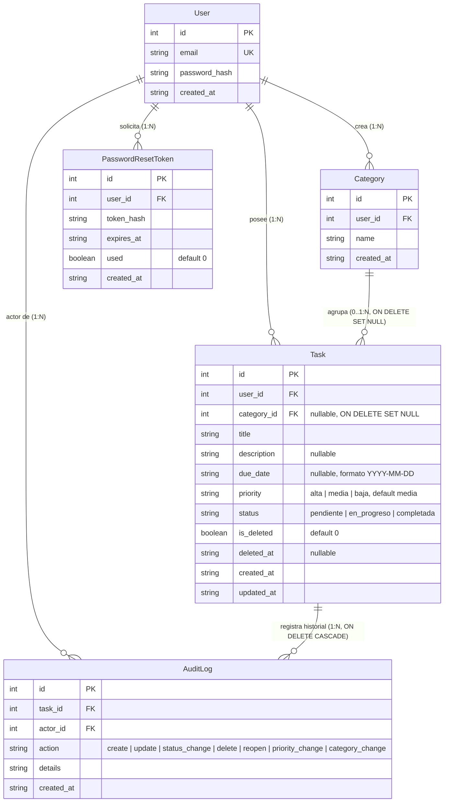

# Data Model: Organización y Priorización de Tareas (Incremento 3)

**Feature**: [spec.md](spec.md) | **Date**: 2026-10-04 | **Branch**: `003-task-organization-prioritization`

---

## 1. Diagrama Entidad-Relación (ERD)



---

## 2. Definición de Entidades de Dominio (`src/domain/models.py`)

Las entidades de dominio permanecen como dataclasses puras de Python, completamente desacopladas de la infraestructura ORM:

```python
from dataclasses import dataclass
from typing import Optional


@dataclass
class User:
    id: Optional[int]
    email: str
    password_hash: str
    created_at: str


@dataclass
class Category:
    id: Optional[int]
    user_id: int
    name: str
    created_at: str = ""


@dataclass
class Task:
    id: Optional[int]
    user_id: int
    title: str
    description: Optional[str] = None
    due_date: Optional[str] = None          # Formato YYYY-MM-DD (sin hora)
    priority: str = "media"                 # 'alta', 'media', 'baja'
    category_id: Optional[int] = None       # Referencia a Category.id o None
    category_name: Optional[str] = None     # Propiedad decorada/denormalizada para vistas
    status: str = "pendiente"               # 'pendiente', 'en_progreso', 'completada'
    is_deleted: bool = False
    deleted_at: Optional[str] = None
    is_overdue: bool = False                # Campo derivado en tiempo de consulta, no persistido
    created_at: str = ""
    updated_at: str = ""


@dataclass
class AuditLog:
    id: Optional[int]
    task_id: int
    actor_id: int
    action: str                             # 'create', 'update', 'status_change', 'delete', 'reopen', 'priority_change', 'category_change'
    details: str
    created_at: str


@dataclass
class PasswordResetToken:
    id: Optional[int]
    user_id: int
    token_hash: str
    expires_at: str
    used: bool = False
    created_at: str = ""
```

---

## 3. Modelos ORM SQLAlchemy (`src/infrastructure/models.py`)

### 3.1 Nueva Entidad `CategoryORM`
```python
class CategoryORM(db.Model):
    __tablename__ = "categories"

    id = db.Column(db.Integer, primary_key=True, autoincrement=True)
    user_id = db.Column(db.Integer, db.ForeignKey("users.id", ondelete="CASCADE"), nullable=False)
    name = db.Column(db.String(50), nullable=False)
    created_at = db.Column(db.String(35), nullable=False)

    user = db.relationship("UserORM", backref=db.backref("categories", cascade="all, delete-orphan", passive_deletes=True))
    tasks = db.relationship("TaskORM", backref="category", passive_deletes=True)

    __table_args__ = (
        db.UniqueConstraint("user_id", "name", name="uq_categories_user_name"),
        db.Index("idx_categories_user_id", "user_id"),
    )
```

### 3.2 Modelo `TaskORM` Ampliado
```python
class TaskORM(db.Model):
    __tablename__ = "tasks"

    id = db.Column(db.Integer, primary_key=True, autoincrement=True)
    user_id = db.Column(db.Integer, db.ForeignKey("users.id", ondelete="CASCADE"), nullable=False)
    category_id = db.Column(db.Integer, db.ForeignKey("categories.id", ondelete="SET NULL"), nullable=True)
    title = db.Column(db.String(150), nullable=False)
    description = db.Column(db.String(1000), nullable=True)
    due_date = db.Column(db.String(30), nullable=True)  # Formato textual YYYY-MM-DD
    priority = db.Column(
        db.String(10),
        nullable=False,
        default="media",
        server_default="media",
    )
    status = db.Column(
        db.String(20),
        nullable=False,
        default="pendiente",
        server_default="pendiente",
    )
    is_deleted = db.Column(db.Boolean, nullable=False, default=False, server_default=sa.text("0"))
    deleted_at = db.Column(db.String(35), nullable=True)
    created_at = db.Column(db.String(35), nullable=False)
    updated_at = db.Column(db.String(35), nullable=False)

    audit_logs = db.relationship("AuditLogORM", backref="task", cascade="all, delete-orphan", passive_deletes=True)

    __table_args__ = (
        db.CheckConstraint("status IN ('pendiente', 'en_progreso', 'completada')", name="chk_tasks_status"),
        db.CheckConstraint("priority IN ('alta', 'media', 'baja')", name="chk_tasks_priority"),
        db.Index("idx_tasks_user_id", "user_id"),
        db.Index("idx_tasks_user_status", "user_id", "status"),
        db.Index("idx_tasks_user_created", "user_id", "created_at"),
        db.Index("idx_tasks_user_active", "user_id", "is_deleted", "created_at"),
        db.Index("idx_tasks_user_priority", "user_id", "priority"),
        db.Index("idx_tasks_user_category", "user_id", "category_id"),
    )
```

### 3.3 Modelo `AuditLogORM` Ampliado
```python
class AuditLogORM(db.Model):
    __tablename__ = "audit_logs"

    id = db.Column(db.Integer, primary_key=True, autoincrement=True)
    task_id = db.Column(db.Integer, db.ForeignKey("tasks.id", ondelete="CASCADE"), nullable=False)
    actor_id = db.Column(db.Integer, db.ForeignKey("users.id"), nullable=False)
    action = db.Column(db.String(20), nullable=False)
    details = db.Column(db.Text, nullable=False)
    created_at = db.Column(db.String(35), nullable=False)

    actor = db.relationship("UserORM", backref="audit_logs")

    __table_args__ = (
        db.CheckConstraint(
            "action IN ('create', 'update', 'status_change', 'delete', 'reopen', 'priority_change', 'category_change')",
            name="chk_audit_logs_action"
        ),
        db.Index("idx_audit_logs_task", "task_id"),
        db.Index("idx_audit_logs_actor", "actor_id"),
    )
```

---

## 4. Esquema DDL SQL Generado por Migración 003

```sql
-- 1. Creación de la tabla de categorías
CREATE TABLE categories (
    id INTEGER PRIMARY KEY AUTOINCREMENT,
    user_id INTEGER NOT NULL,
    name VARCHAR(50) NOT NULL,
    created_at VARCHAR(35) NOT NULL,
    CONSTRAINT uq_categories_user_name UNIQUE (user_id, name),
    CONSTRAINT fk_categories_user_id FOREIGN KEY (user_id) REFERENCES users (id) ON DELETE CASCADE
);

CREATE INDEX idx_categories_user_id ON categories (user_id);

-- 2. Modificación de la tabla tasks (vía Alembic batch mode para SQLite)
-- Añade columnas priority y category_id preservando todas las filas y columnas existentes:
ALTER TABLE tasks ADD COLUMN priority VARCHAR(10) NOT NULL DEFAULT 'media';
ALTER TABLE tasks ADD COLUMN category_id INTEGER NULL REFERENCES categories(id) ON DELETE SET NULL;

CREATE INDEX idx_tasks_user_priority ON tasks (user_id, priority);
CREATE INDEX idx_tasks_user_category ON tasks (user_id, category_id);

-- 3. Modificación de la tabla audit_logs (vía Alembic batch mode para SQLite)
-- Recrea la tabla audit_logs de forma segura preservando todas las filas históricas existentes:
-- Amplía la restricción chk_audit_logs_action para permitir 'priority_change' y 'category_change':
-- CHECK (action IN ('create', 'update', 'status_change', 'delete', 'reopen', 'priority_change', 'category_change'))
-- Preserva índices idx_audit_logs_task e idx_audit_logs_actor y claves foráneas.
```

---

## 5. Reglas de Negocio e Integridad Referencial

1. **Desvinculación sin Cascada (ON DELETE SET NULL)**:
   - Cuando una fila en `categories` es eliminada (`DELETE FROM categories WHERE id = ?`), el motor SQLite (con `PRAGMA foreign_keys = ON`) actualiza de forma nativa e inmediata las filas de `tasks` fijando `category_id = NULL`. Las tareas conservan todos sus atributos, estados y relaciones sin ser destruidas ni alteradas de otro modo.
2. **Prioridad Obligatoria y Valores Válidos**:
   - `priority` solo acepta `'alta'`, `'media'` y `'baja'`. Cualquier otro valor es rechazado con `ValidationError`. Si se omite al crear una tarea, se asigna automáticamente `'media'`.
3. **Cálculo Derivado de Vencimiento (`is_overdue`)**:
   - Se evalúa en memoria durante la consulta de tareas mediante la fórmula:
     `due_date is not None and due_date.strip() != "" and due_date < today_utc and status != "completada" and not is_deleted`.
   - Si `due_date == today_utc`, `is_overdue = False`.
   - Tareas sin fecha límite, completadas o eliminadas lógicamente tienen siempre `is_overdue = False`.
4. **Ordenamiento Predeterminado y por Prioridad**:
   - El listado de tareas conserva como comportamiento predeterminado el orden cronológico descendente (`created_at DESC`).
   - La jerarquía `alta` → `media` → `baja` (o su orden inverso) se aplica únicamente cuando el usuario selecciona explícitamente ordenar por prioridad.
5. **Registro de Auditoría Extendido**:
   - Toda modificación de prioridad en una tarea registra un evento `priority_change`.
   - Toda asignación, cambio o desvinculación explícita de categoría en una tarea registra un evento `category_change`.
   - La migración 003 garantiza que la restricción CHECK de `audit_logs.action` admita ambas acciones sin fallos de integridad referencial.
