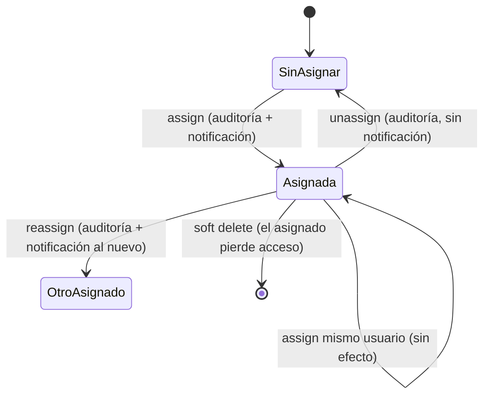

# Data Model: Colaboración entre Usuarios (Incremento 4)

Migración: `migrations/versions/<rev>_004_task_collaboration.py`, `down_revision = 'a6aa1e24bf8e'`. Fechas como cadenas ISO 8601 UTC (convención existente).

## Cambios en entidades existentes

### `tasks` (TaskORM)

| Campo | Tipo | Reglas |
|-------|------|--------|
| `user_id` | INTEGER NOT NULL FK users (CASCADE) | **Propietario**; sin cambios, no se modifica al asignar |
| `assignee_id` *(nuevo)* | INTEGER NULL FK users (`ON DELETE SET NULL`) | Asignado vigente; NULL = sin asignar; nunca igual a `user_id` (validado en dominio) |

Índice nuevo: `idx_tasks_assignee (assignee_id, is_deleted, created_at)`. Datos previos: `assignee_id = NULL`.

### `audit_logs` (AuditLogORM)

CHECK `chk_audit_logs_action` ampliado:
`create, update, status_change, delete, reopen, priority_change, category_change, assign, reassign, unassign`.

`details` (JSON) para los nuevos eventos: `{"old_assignee_id": <int|null>, "new_assignee_id": <int|null>}`. `actor_id` = propietario. `created_at` = ISO 8601 UTC.

## Entidad nueva: `notifications` (NotificationORM)

| Campo | Tipo | Reglas |
|-------|------|--------|
| `id` | INTEGER PK autoincrement | — |
| `recipient_id` | INTEGER NOT NULL FK users (CASCADE) | Nuevo asignado; solo él la consulta |
| `task_id` | INTEGER NOT NULL FK tasks (CASCADE) | Referencia; no habilita acceso |
| `actor_id` | INTEGER NOT NULL FK users | Usuario que asignó |
| `type` | VARCHAR(20) NOT NULL, CHECK `type IN ('task_assigned')` | Único tipo en este incremento |
| `message` | VARCHAR(255) NOT NULL | Texto fijo: fecha y correo de quien asignó; **sin título de tarea** |
| `is_read` | BOOLEAN NOT NULL default 0 | — |
| `read_at` | VARCHAR(35) NULL | Se fija al marcar leída (primera vez) |
| `created_at` | VARCHAR(35) NOT NULL | Momento de la asignación |

Índices: `idx_notifications_recipient (recipient_id, is_read, created_at)`, `idx_notifications_task_recipient (task_id, recipient_id)`.

Reglas:
- Nunca se borran físicamente (D4); solo cambia `is_read`/`read_at`.
- Se crea exactamente una por asignación/reasignación efectiva, en la misma transacción que la asignación y su auditoría.
- **Disponibilidad (derivada, no persistida)**: `available = NOT task.is_deleted AND task.assignee_id = recipient_id AND id = MAX(id) FILTER (task_id, recipient_id)`.

## Modelos de dominio (`src/domain/models.py`)

- `Task` + `assignee_id: Optional[int]`, `assignee_email: Optional[str]`, `owner_email: Optional[str]`, `viewer_role: str` (`owner` | `assignee`, calculado por consulta, no persistido).
- `Notification`: `id, recipient_id, task_id, actor_id, type, message, is_read, read_at, created_at` + vista `available`, `task_title`/`task_status` solo cuando `available`.

## Transiciones y reglas

| Regla | Validación |
|-------|-----------|
| Solo propietario asigna/reasigna/desasigna | `permissions.authorize(MANAGE_ASSIGNMENT)` |
| Destinatario existente | búsqueda por correo normalizado |
| No autoasignación | `assignee.id != task.user_id` → 400 |
| Tarea eliminada no asignable | 404 |
| Mismo asignado | respuesta 200 `changed=false`, sin escritura |
| Concurrencia | `UPDATE … WHERE assignee_id IS :old`; 0 filas → 409 |

## Matriz de permisos (implementada en `permissions.py`)

| Operación | Propietario | Asignado vigente | Ajeno |
|-----------|:-----------:|:----------------:|:-----:|
| VIEW | ✔ | ✔ | 404 |
| CHANGE_STATUS | ✔ | ✔ | 404 |
| REOPEN | ✔ | ✔ | 404 |
| EDIT (campos, prioridad, categoría) | ✔ | 403 | 404 |
| DELETE | ✔ | 403 | 404 |
| MANAGE_ASSIGNMENT | ✔ | 403 | 404 |

## Consultas clave

- **Listado**: `SELECT tasks.*, owner.email, assignee.email FROM tasks LEFT JOIN users owner … LEFT JOIN users assignee … WHERE is_deleted=0 AND (user_id=:u OR assignee_id=:u) [AND role/status/category] ORDER BY …`. Una fila por tarea.
- **Contador de no leídas**: `SELECT COUNT(*) FROM notifications WHERE recipient_id=:u AND is_read=0`.
- **Lista de notificaciones**: `WHERE recipient_id=:u ORDER BY is_read ASC, created_at DESC, id DESC LIMIT 50` con `LEFT JOIN tasks` y subconsulta de `MAX(id)` para `available`.
